# Who is undercover?  :shipit:

## Table of Content

- [Introduction](#introduction)
- [Built With](#built-with)
- [High-level components](#main-components)
- [Deployment](#deployment)
- [Illustrations](#illustrations)
- [Roadmap](#roadmap)
- [Authors & Acknowledgments](#authors--acknowledgments)
- [License](#license)

## Introduction
"Who's Undercover" is a very popular social party game from China that usually requires 4 or more players to play together. The game aims to find out the "Undercover" characters hidden among all players through description and reasoning. 

The game consists of at least 4 people and at most 8 people. After the game starts, everyone will be assigned a word. You may be assigned a different word, which means you are undercover. Usually in a game Among them, if there are 5 players, including games with less than 5 players, one person is undercover, and games with more than 5 players have two undercovers. Each round of the game has a description link. As an undercover, you should try your best to hide your identity. 

As a detective, you Carefully observe whether other players are undercover. After each round of description, players must vote for a player. When the number of undercovers is the same as the number of detectives, the undercover victory is declared. If all undercovers are voted out, the detection wins. Have fun !


## Built With
* [React](https://react.dev/) - Frontend JavaScript library developed by facebook
* [STOMP](https://stomp-js.github.io/stomp-websocket/) - Text agreement for configuring WebSocket connections
* [SockJS](https://github.com/sockjs) - API compatible with WebSocket
* [NPM](https://www.npmjs.com/) - Build automation tool

## Main Components

#### Leaderboard
The [Leaderboard](https://github.com/sopra-fs23-group-01/sopra-fs23-group-01-client/blob/main/src/components/views/Leaderboard.js) can display all players, and can rank players according to their different identities in the game, and the highest ranked player can get the supreme crown display!

#### Room
The [Room](https://github.com/sopra-fs23-group-01/sopra-fs23-group-01-client/blob/main/src/components/views/Room.js) is the main interface of our game, which covers the game chat interface and game help, etc. Based on websocket and RESTful, it can realize interesting game progress and interact with other players. You can send messages, vote, etc. in the room.

#### Lobby
The [Lobby](https://github.com/sopra-fs23-group-01/sopra-fs23-group-01-client/blob/main/src/components/views/Lobby.js) is an interface to display room information. Thanks to websocket, the room created by the player can be refreshed and displayed in the lobby in real time, including complete room information, such as theme, number of people, room status, etc., which will follow the status of the room in real time Displayed on the lobby interface.

#### RoomCreation
The [RoomCreation](https://github.com/sopra-fs23-group-01/sopra-fs23-group-01-client/blob/main/src/components/views/RoomCreation.js) allow players creates a room, the player can freely choose the number of people and the theme of the room. After creation, the player will automatically enter the room and become the owner of the room, and send the room information to the server in real time.

#### Profile
The [Profile](https://github.com/sopra-fs23-group-01/sopra-fs23-group-01-client/blob/main/src/components/views/Profile.js)is more colorful, including automatically generated avatars, introductions, genders, winning percentages, etc. for players. Of course, you can make personalized changes in [EditProfile](https://github.com/sopra-fs23-group-01/sopra-fs23-group-01-client/blob/main/src/components/views/EditProfile.js). You can freely choose other avatars and write your own personal introduction.

## Deployment
These instructions will get you a copy of the project up and running on your local machine for development and testing purposes. See [deployment](#deployment) for notes on how to deploy the project on a live system.
### Clone Repository
Clone the client-repository onto your local machine with the help of [Git](https://git-scm.com/downloads).
```bash 
git clone https://github.com/sopra-fs23-group-01/sopra-fs23-group-01-client.git
```

### Prerequisites and Installation
For your local development environment, you will need Node.js. You can download it [here](https://nodejs.org). All other dependencies, including React, get installed with:

```npm install```

### Run

Run this command before you start your application for the first time. Next, you can start the app with:

```npm run dev```

Now you can open [http://localhost:3000](http://localhost:3000) to view it in the browser.

Notice that the page will reload if you make any edits. You will also see any lint errors in the console (use Google Chrome).

### Testing
Testing is optional, and you can run the tests with `npm run test`.
This launches the test runner in an interactive watch mode. See the section about [running tests](https://facebook.github.io/create-react-app/docs/running-tests) for more information.

> For macOS user running into a 'fsevents' error: https://github.com/jest-community/vscode-jest/issues/423

### Build
Finally, `npm run build` builds the app for production to the `build` folder.<br>
It correctly bundles React in production mode and optimizes the build for the best performance: the build is minified, and the filenames include hashes.<br>

See the section about [deployment](https://facebook.github.io/create-react-app/docs/deployment) for more information.

### Releases
- [Releases refer to the GitHub documentation](https://docs.github.com/en/repositories/releasing-projects-on-github/managing-releases-in-a-repository)


## Illustrations
### Mobile Vision

<table>
    <tr>
        <td align="center">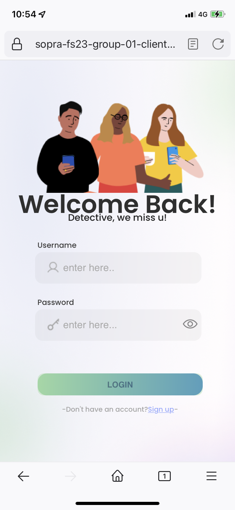<br />Login Screen</td>
        <td align="center">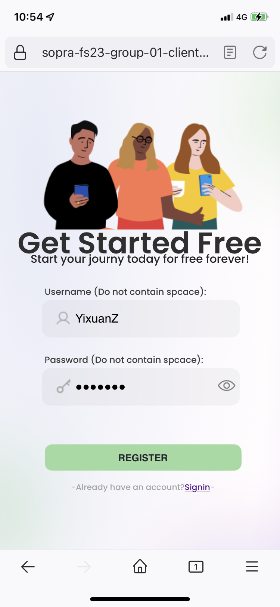<br />Register Screen</td>
        <td align="center">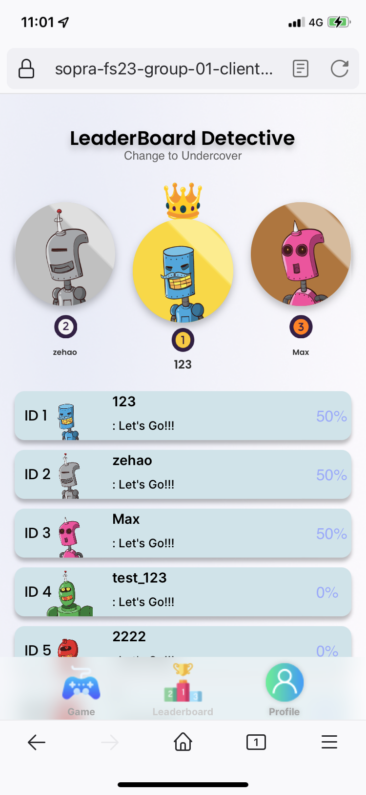<br />Leaderboard Screen</td>
        <td align="center">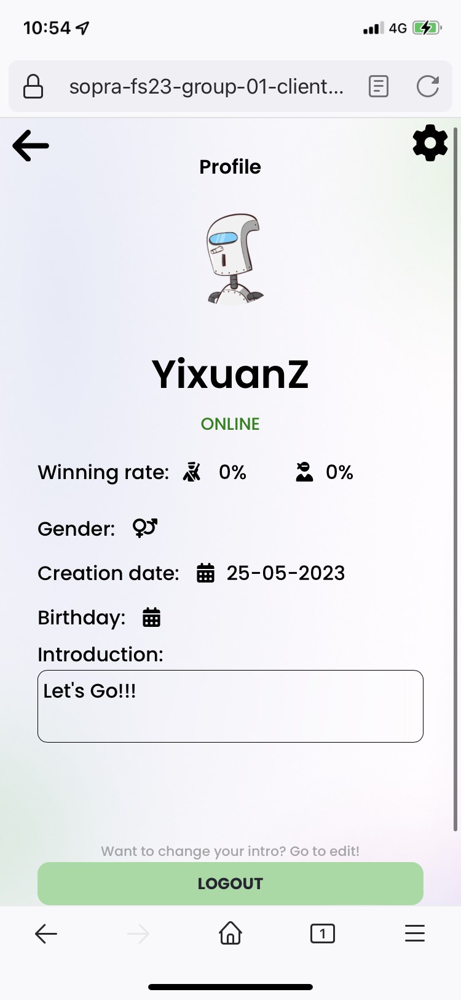<br />Profile Screen</td>
    </tr>
    <tr>
        <td align="center">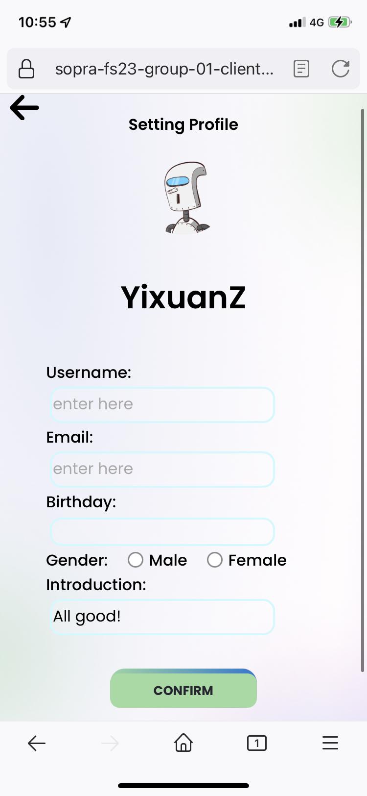<br />Edit Profile Screen</td>
        <td align="center">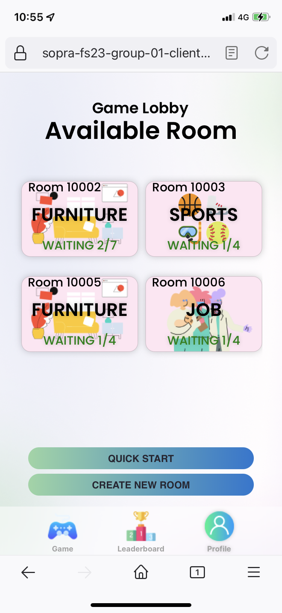<br />Lobby Screen</td>
        <td align="center">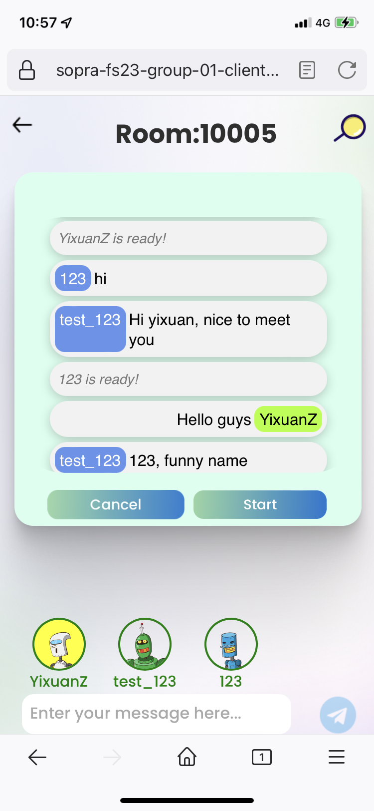<br />Room Waiting Screen</td>
        <td align="center">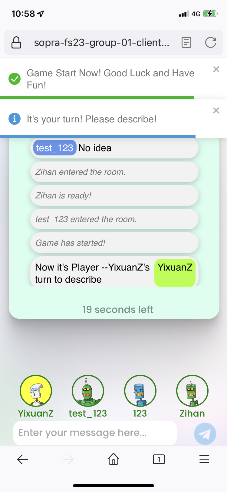<br />Room Discribe Screen</td>
    </tr>
</table>

### Desktop Vision

<table>
    <tr>
        <td align="center">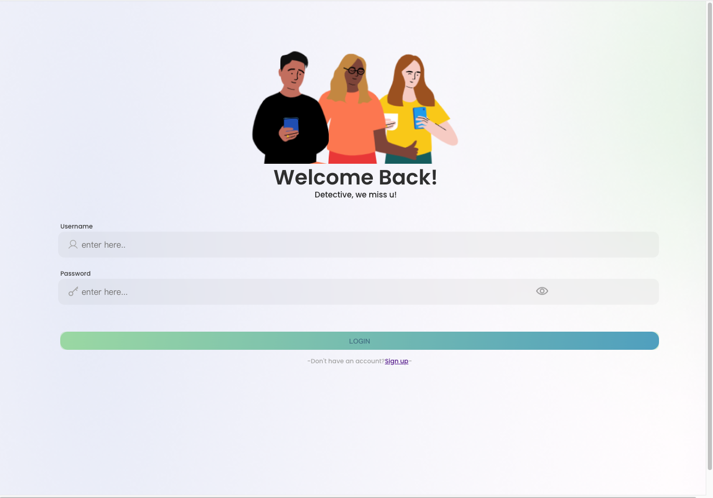<br />Login Screen</td>
        <td align="center">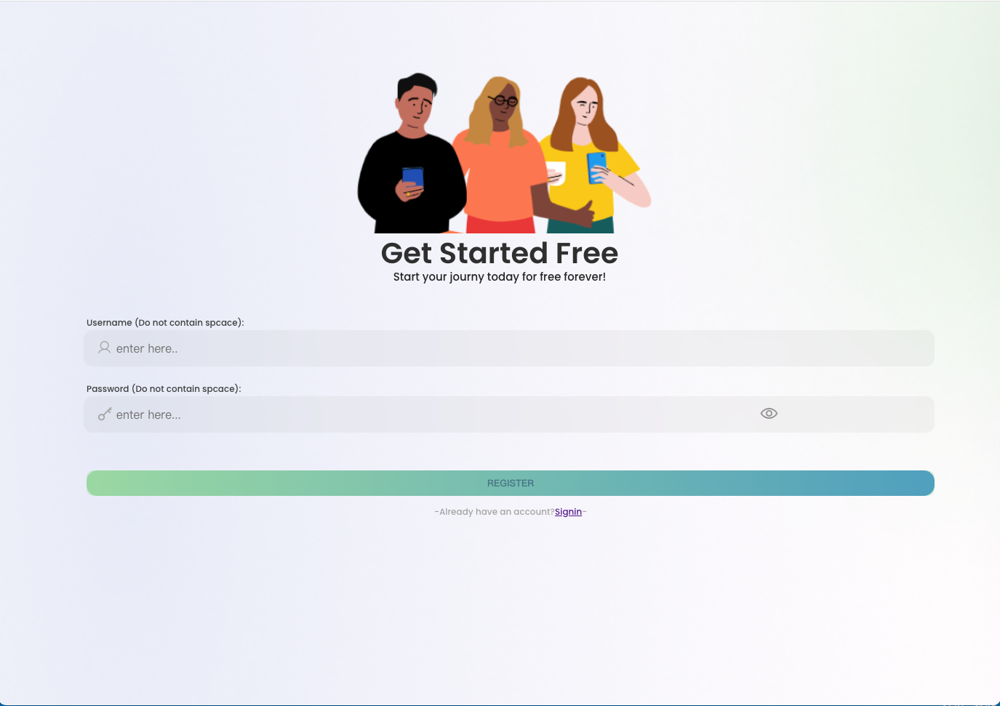<br />Register Screen</td>
        <td align="center">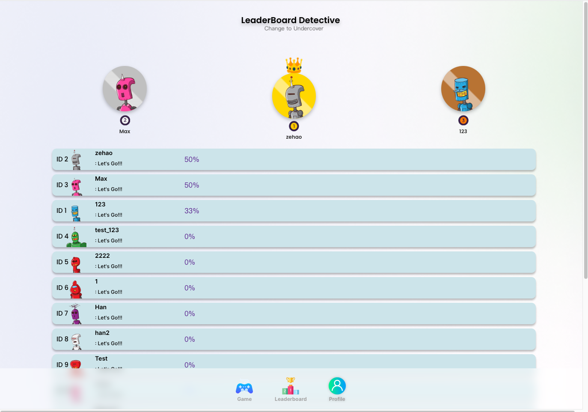<br />Leaderboard Screen</td>
        <td align="center">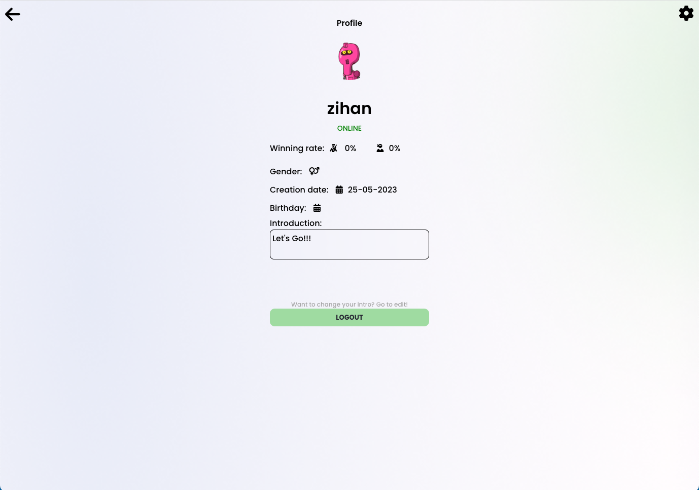<br />Profile Screen</td>
    </tr>
    <tr>
        <td align="center">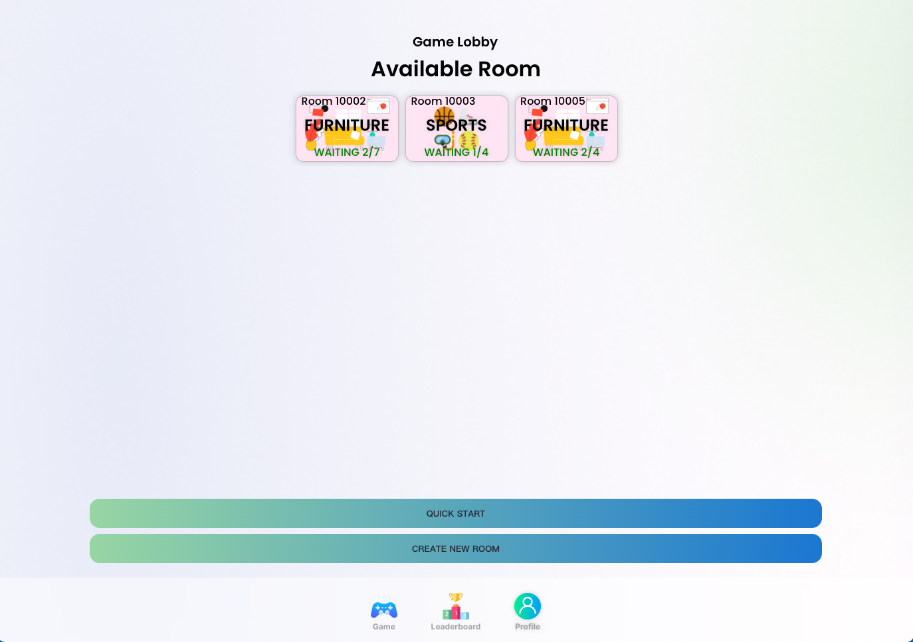<br />Lobby Screen</td>
        <td align="center">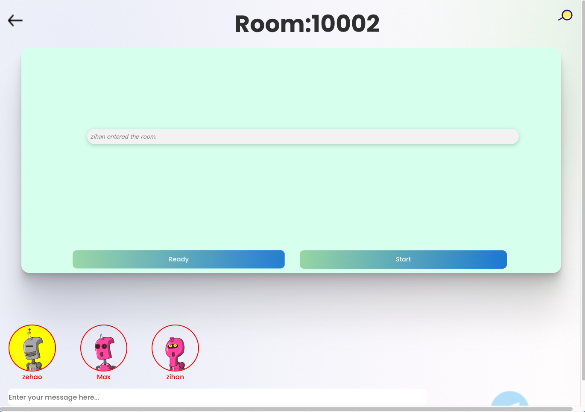<br />Room Screen</td>
        <td align="center">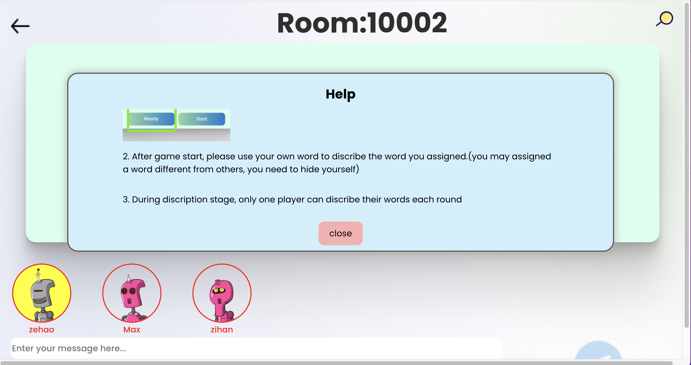<br />Help Screen</td>
    </tr>
</table>


## Illustrations
### Mobile Vision
<div style="text-align: center;">
    <figure style="display: inline-block">
        
        <figcaption>Login Screen</figcaption>
    </figure>
    <figure style="display: inline-block">
        
        <figcaption>Register Screen</figcaption>
    </figure>
    <figure style="display: inline-block">
        
        <figcaption>Leaderboard Screen</figcaption>
    </figure>
    <figure style="display: inline-block">
        
        <figcaption>Profile Screen</figcaption>
    </figure>
    <figure style="display: inline-block">
        
        <figcaption>Edit Profile Screen</figcaption>
    </figure>
        <figure style="display: inline-block">
        
        <figcaption>Lobby Screen</figcaption>
    </figure>
    </figure>
        <figure style="display: inline-block">
        
        <figcaption>Room Waiting Screen</figcaption>
    </figure>
    </figure>
        <figure style="display: inline-block">
        
        <figcaption>Room Discribe Screen</figcaption>
    </figure>
    </figure>
        <figure style="display: inline-block">
        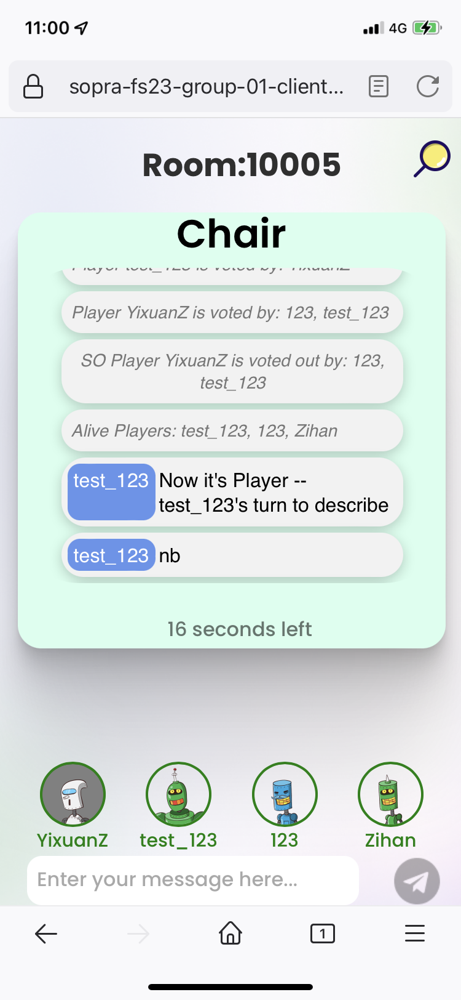
        <figcaption>Room Vote Screen</figcaption>
    </figure>
    </figure>
        <figure style="display: inline-block">
        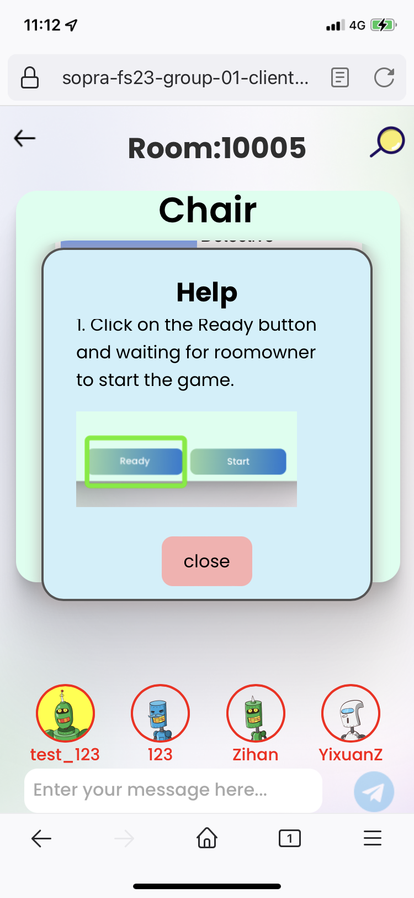
        <figcaption>Room Help Screen</figcaption>
    </figure>
    </figure>
        <figure style="display: inline-block">
        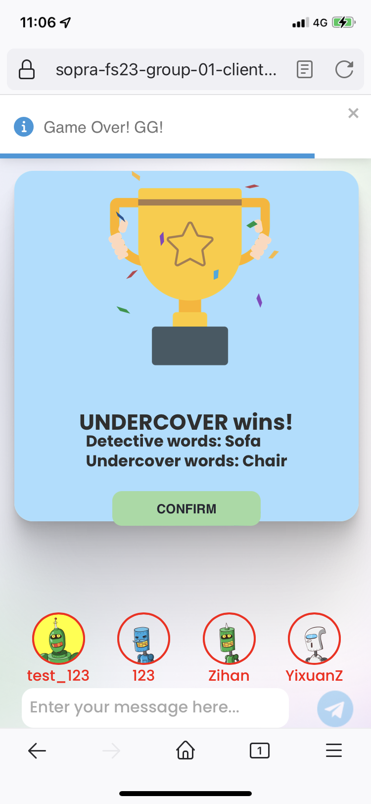
        <figcaption>Room Win Screen</figcaption>
    </figure>
    </figure>
    </figure>
        <figure style="display: inline-block">
        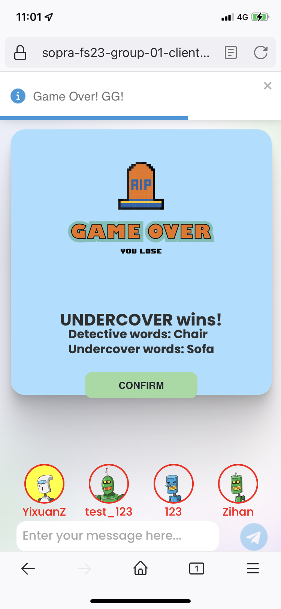
        <figcaption>Room Lose Screen</figcaption>
    </figure>
</div>

### Desktop Vision
<div style="text-align: center;">
    <figure style="display: inline-block">
        
        <figcaption>Login Screen</figcaption>
    </figure>
    <figure style="display: inline-block">
        
        <figcaption>Register Screen</figcaption>
    </figure>
    <figure style="display: inline-block">
        
        <figcaption>Leaderboard Screen</figcaption>
    </figure>
    <figure style="display: inline-block">
        
        <figcaption>Profile Screen</figcaption>
    </figure>
    <figure style="display: inline-block">
        
        <figcaption>Lobby Screen</figcaption>
    </figure>
    <figure style="display: inline-block">
        
        <figcaption>Room Screen</figcaption>
    </figure>
        <figure style="display: inline-block">
        
        <figcaption>Help Screen</figcaption>
    </figure>

</div>

## Roadmap
New developers who want to contribute to your projec could add:
- More game modes, such as more themes
- Add kicking function to the room
- Add friend function, friends in the game can play a game together

## Authors & Acknowledgments
### Authors
* **Zihan Liu** - [zihanltesla](https://github.com/zihanltesla)
* **Han Yang** - [Haaaan1](https://github.com/Haaaan1)
* **Yixuan Zhou** - [yixuan-zhou-uzh](https://github.com/yixuan-zhou-uzh)
* **Zehao Zhang** - [Zehao-Zhang](https://github.com/Zehao-Zhang)

### Acknowledgments
We extend our deepest gratitude to our tutor, [Valentin](https://github.com/v4lentin1879) as well as to the entire team involved in the Software Engineering Lab course at the University of Zurich.

## License
This project is licensed under the Apache License 2.0 - see the [LICENSE](https://github.com/sopra-fs23-group-01/sopra-fs23-group-01-server/blob/main/LICENSE) file for details.
